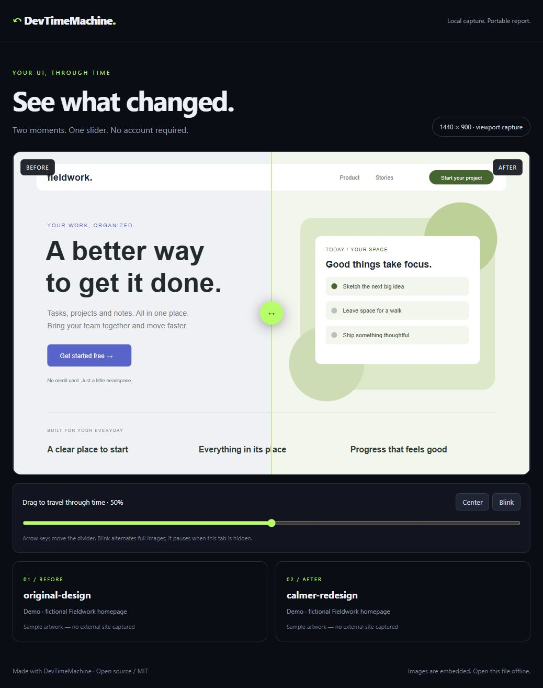

<div align="center">

# ↶ DevTimeMachine

**Your website changed. See exactly how it looks different.**

Capture two moments of your UI. Drag between them. Share one HTML file.

**Local screenshots · Offline comparison · No account · MIT**



</div>

You tweak your landing page, change a component, or update a stylesheet. Then you wonder: *was it better before?* DevTimeMachine keeps a visual checkpoint so you can decide with both versions in front of you.

## Try the demo in 10 seconds

Requires Node.js 20 or newer. Clone or download this repository, open a terminal in its folder, then:

```sh
node bin/dtm.mjs demo
```

Open **demo.html** in your browser. The demo uses included fictional artwork and needs no dependency installation, internet connection or API key.

## Capture your own website

Install the screenshot engine once:

```sh
npm install
npm run setup
```

Start your website, then save a checkpoint:

```sh
node bin/dtm.mjs capture http://localhost:3000 --name before
```

Make your changes and capture again:

```sh
node bin/dtm.mjs capture http://localhost:3000 --name after
node bin/dtm.mjs compare before after --out comparison.html
```

Open **comparison.html**. The screenshots are embedded, so you can send that single file to a teammate and they can open it offline.

## What you get

- **Before/after slider:** mouse, touch or keyboard control.
- **Blink mode:** switch between complete images to spot movement. Honors reduced-motion preferences and stops when the tab is hidden.
- **Portable report:** no backend, CDN, external fonts or account needed to view it.
- **Repeatable browser settings:** fixed viewport, light theme, UTC timezone, English locale and reduced motion.
- **Safer saves:** existing snapshot names and report files are never overwritten.
- **Local storage:** screenshots stay in `.time-machine/`, excluded from Git by default.

## Keep noisy UI out of the comparison

```sh
node bin/dtm.mjs capture http://localhost:3000 --name home-v2 \
  --viewport 1280x720 \
  --selector "[data-ready]" \
  --hide ".live-clock, .rotating-banner" \
  --wait 1000
```

On Windows PowerShell, write the command on one line or use PowerShell's backtick continuation instead of `\`.

| Option | Purpose | Default |
|---|---|---|
| `--name` | Snapshot name; letters, digits, `_` and `-` | Required for capture |
| `--viewport` | Width × height, each between 100 and 3840 | `1440x900` |
| `--selector` | Wait for a CSS selector to become visible | None |
| `--hide` | CSS selector(s) to hide without collapsing layout | None |
| `--wait` | Extra delay after page load, 0–30000 ms | `300` |
| `--dir` | Snapshot folder for capture and compare | `.time-machine` |
| `--out` | Comparison or demo HTML path | `comparison.html` / `demo.html` |

Both snapshots must use the same viewport. To take another checkpoint, use a new name such as `home-v3`.

## Scope and privacy

This first release captures the **visible viewport**. It compares appearance using a slider; it does not calculate a pixel-difference score or fail builds for regressions. Dynamic content can still differ between captures. Wait for application readiness and hide noisy elements when needed.

Capture uses a fresh browser session. Login flows, saved cookies, multi-page batches and full-page screenshots are not supported yet. No analytics or upload service is included. When you capture a URL, Chromium contacts that website and its resources as a normal browser would.

Screenshots may contain private information. Hiding an element is a visual convenience, not a redaction guarantee. Check the captured images before sharing. Reports also include the captured URL, so avoid secret tokens in query strings. Do not commit private captures or generated reports.

## Contribute

```sh
npm test
```

Core tests and the generated demo run without installing Playwright. See [CONTRIBUTING.md](CONTRIBUTING.md) for contribution guidance.

Useful next contributions:

- [ ] Side-by-side view
- [ ] Multiple routes from a configuration file
- [ ] Explicit authenticated-session support
- [ ] Pixel-difference overlay and optional regression threshold
- [ ] GitHub Actions screenshot comparison example

## License

[MIT](LICENSE). If this saves you a “what changed?” moment, a star helps other people find it.
